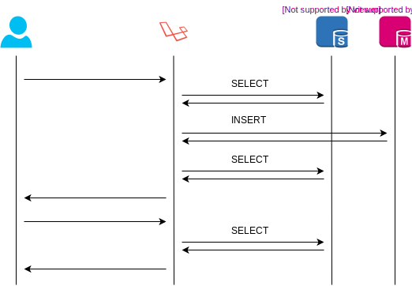
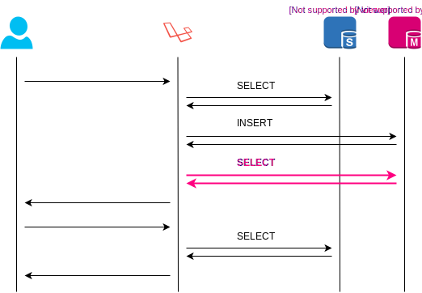
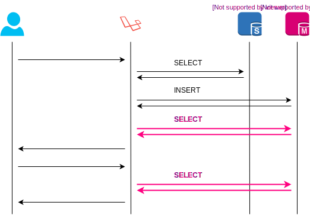

# Laravel Cached Database Stickiness<br>[](https://travis-ci.org/mpyw/laravel-cached-database-stickiness) [](https://coveralls.io/github/mpyw/laravel-cached-database-stickiness?branch=master) [](https://scrutinizer-ci.com/g/mpyw/laravel-cached-database-stickiness/?branch=master)

Guarantee database stickiness over the same user's consecutive requests.

## Requirements

- PHP: ^7.1
- Laravel: ^5.8 || ^6.0

## Installing

```bash
composer require mpyw/laravel-cached-database-stickiness
```

The default implementation is provided by `ConnectionServiceProvider`, however, **package discovery is not available**.
Be careful that you MUST register it in **`config/app.php`** by yourself.

```php
<?php

return [

    /* ... */

    'providers' => [

        /* ... */

        Mpyw\LaravelCachedDatabaseStickiness\ConnectionServiceProvider::class,

        /* ... */

    ],

    /* ... */
];
```

## Features

This library provides the following features.

- Make HTTP server to take over the database sticky state from the previous user's request within the last 5 seconds.
- Make queue worker into referring to master by default. 
- Make queue worker into referring to slave by implementing `ShouldAssumeFresh` on your jobs.

## Diagrams

### Default



### Sticky



### Sticky Cached



## Advanced Usage

### Customize Stickiness TTL

The default stickiness TTL is `5` seconds.
You can configure this value to add **`stickiness_ttl`** directive to your `config/database.php`.

```php
<?php

return [

    /* ... */

    'default' => env('DB_CONNECTION', 'mysql'),

    /*
    |--------------------------------------------------------------------------
    | Database Connections
    |--------------------------------------------------------------------------
    |
    | Here are each of the database connections setup for your application.
    | Of course, examples of configuring each database platform that is
    | supported by Laravel is shown below to make development simple.
    |
    |
    | All database work in Laravel is done through the PHP PDO facilities
    | so make sure you have the driver for your particular database of
    | choice installed on your machine before you begin development.
    |
    */

    'connections' => [

        /* ... */

        'mysql' => [
            'read' => env('DB_HOST_READONLY') ? [
                'host' => env('DB_HOST_READONLY'),
            ] : null,
            'write' => [],
            'sticky' => true,
            'stickiness_ttl' => 3, // Set the stickiness TTL to 3 seconds
            'driver' => 'mysql',
            'host' => env('DB_HOST', '127.0.0.1'),
            'port' => env('DB_PORT', '3306'),
            'database' => env('DB_DATABASE', 'forge'),
            'username' => env('DB_USERNAME', 'forge'),
            'password' => env('DB_PASSWORD', ''),

            /* ... */
        ],

    ],
    
];
```

### Customize Connection Implementation

You can configure Connection implementation.

- Make sure `ConnectionServiceProvider` to be removed from `config/app.php`.
- Extend Connection with `DispatchesConnectionEvents` trait by yourself.

```php
<?php

namespace App\Providers;

use App\Database\MySqlConnection;
use Illuminate\Database\Connection;
use Illuminate\Support\ServiceProvider;

class DatabaseServiceProvider extends ServiceProvider
{
    public function boot(): void
    {
        Connection::resolverFor('mysql', function (...$parameters) {
            return new MySqlConnection(...$parameters);
        });
    }
}
```

```php
<?php

namespace App\Database;

use Illuminate\Database\Connection as BaseMySqlConnection;
use Mpyw\LaravelCachedDatabaseStickiness\DispatchesConnectionEvents;

class MySqlConnection extends BaseMySqlConnection
{
    use DispatchesConnectionEvents;
}
```

### Customize Stickiness Source

You can register the `StickinessResolverInterface` implementation to change the source for stickiness determination.

```php
<?php

namespace App\Providers;

use Illuminate\Support\ServiceProvider;
use Mpyw\LaravelCachedDatabaseStickiness\StickinessResolvers\AuthBasedResolver;
use Mpyw\LaravelCachedDatabaseStickiness\StickinessResolvers\StickinessResolverInterface;

class DatabaseServiceProvider extends ServiceProvider
{
    public function register(): void
    {
        $this->app->bind(StickinessResolverInterface::class, AuthBasedResolver::class);
    }
}
```

| | Source |
|:---:|:---:|
| `IpBasedResolver`<br>**(Default)**| Remote IP address |
| `AuthBasedResolver` | Authenticated User ID |

### Customize Worker Behavior

You can register the `JobInitializerInterface` implementation to change workers' behavior.

```php
<?php

namespace App\Providers;

use Illuminate\Support\ServiceProvider;
use Mpyw\LaravelCachedDatabaseStickiness\JobInitializers\AlwaysFreshInitializer;
use Mpyw\LaravelCachedDatabaseStickiness\JobInitializers\JobInitializerInterface;

class DatabaseServiceProvider extends ServiceProvider
{
    public function register(): void
    {
        $this->app->bind(JobInitializerInterface::class, AlwaysFreshInitializer::class);
    }
}
```

| | General Jobs | `ShouldAssumeFresh` Jobs | `ShouldAssumeModified` Jobs |
|:---:|:---:|:---:|:---:|
| `AlwaysModifiedInitializer`<br>**(Default)**| Master | **Slave** | Master |
| `AlwaysFreshInitializer` | Slave | Slave | **Master** |
